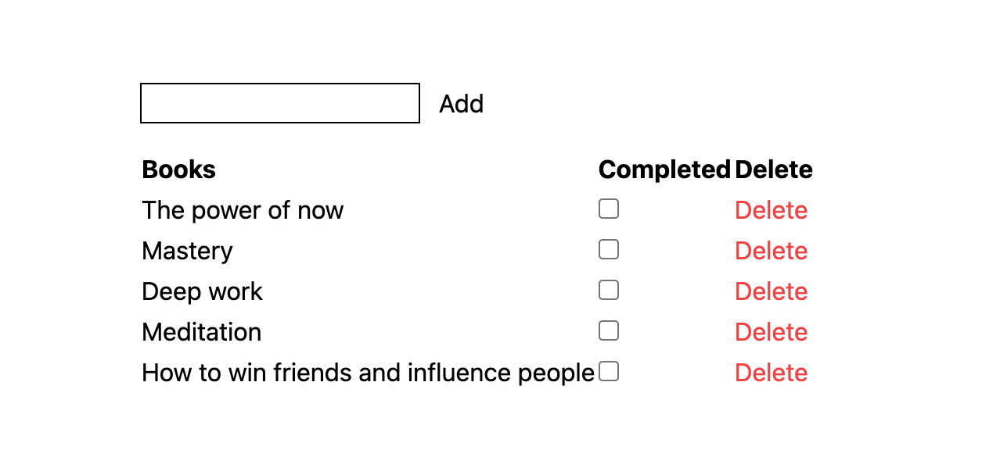

# Book Management System



## Tech stack
With the hype of Bun 1.0 release, I made this project to experiment with Bun and a bunch of new tools. This is by no means a production-ready project.
- Runtime: Bun
- Database: Bun build-in SQLite
- BE Framework: Elysiajs
- ORM: Drizzle
- Package manager: Bun
- Frontend: HTMX, Tailwindcss

## Getting started
```bash
bun install
bun dev
```

## TODO
- [ ] Modifying the database result in a new empty item being added/removed from the list. Refreshing the page fixes it.

## Issues

### Drizzle kit not support bun:sqlite yet
https://github.com/drizzle-team/drizzle-kit-mirror/issues/143#issuecomment-1714043838

## Attribution
The tech stack here is inspired by [the-beth-stack](https://github.com/ethanniser/the-beth-stack) repo. I added support for `Bun:sqlite` and make it more structured. He has an Youtube channel. I highly recommend you to check him out.
